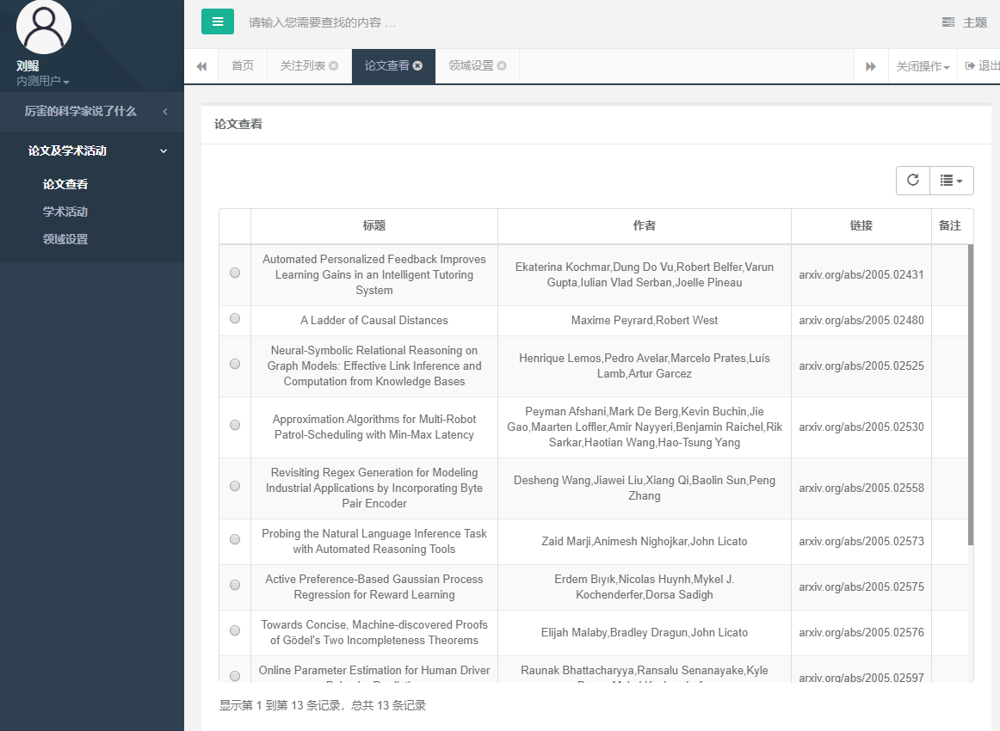
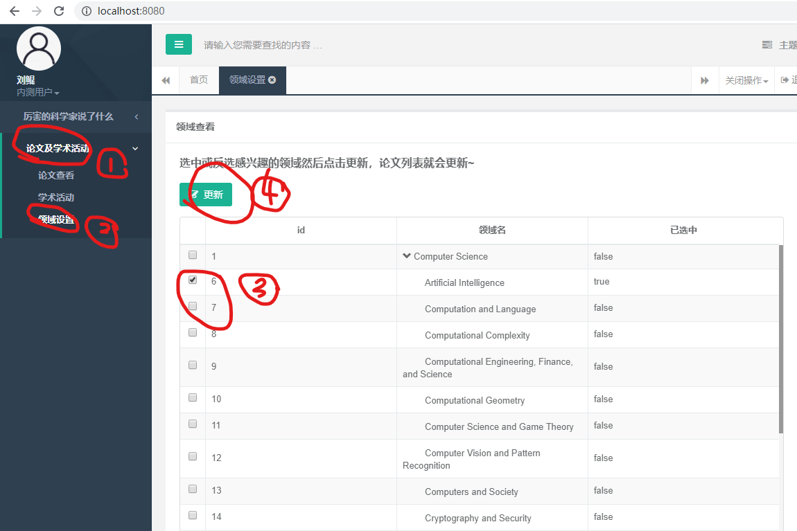
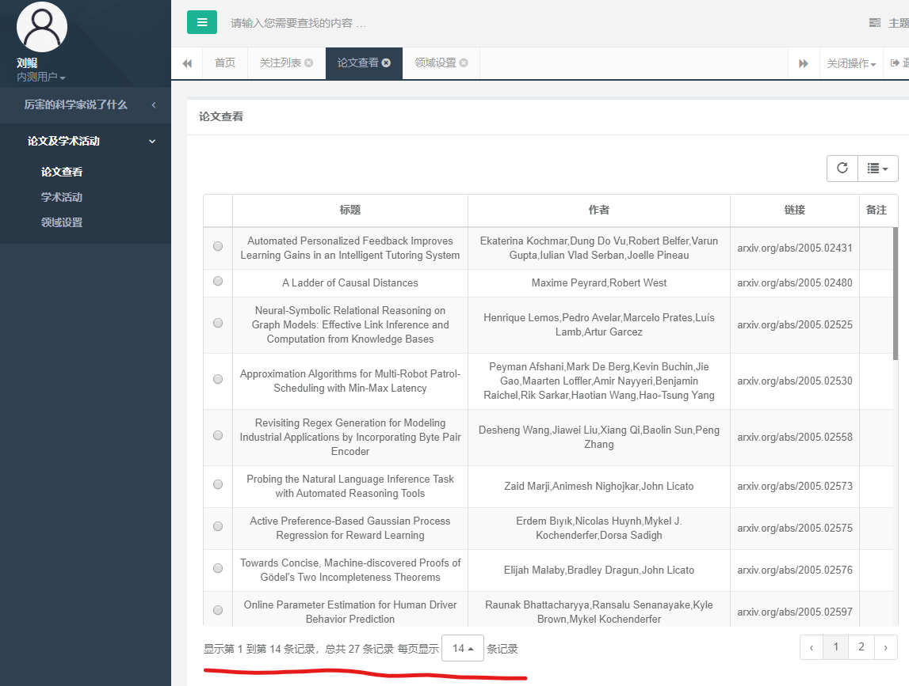
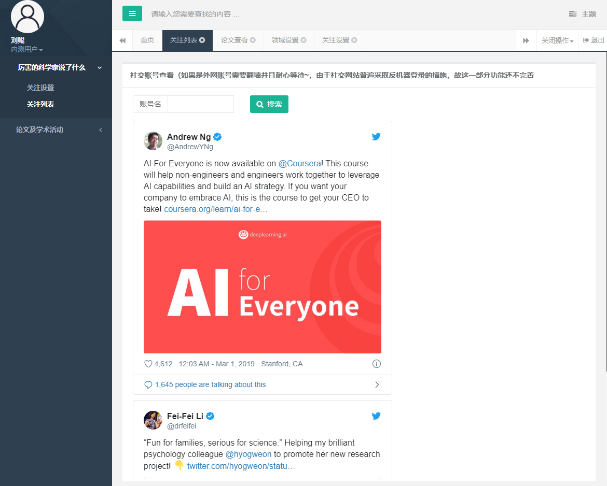
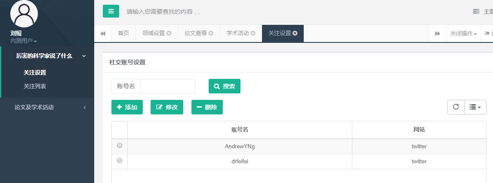
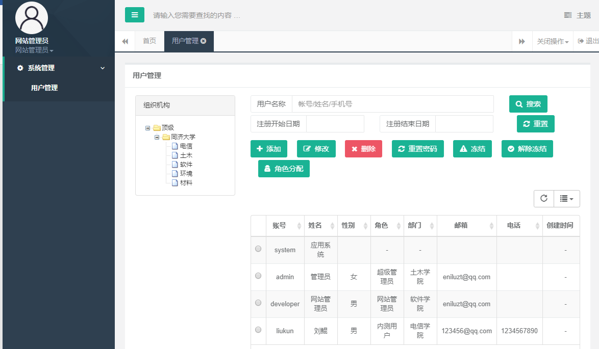

# 科研资讯推送系统

在后台管理框架[guns-lite](http://enilu.gitee.io/guns-lite/)上进行开发

# 技术选型
核心框架：spring boot
数据库层：spring data jpa
安全框架：Shiro
数据库连接池：Druid
缓存：Ehcache

**部署**
阿里云学生机: ecs.n4.small
Tomcat: 9.0
JDK: 1.8
数据库: MySQL 8.0
操作系统: CentOS 7

**爬虫**
See [dailyarxiv.ipynb](./dailyarxiv.ipynb)

# 功能
## 查看论文


## 设置领域

再次查看，可以看到论文变化


## 查看学术活动


## 关注实体查看


## 关注实体设置


## 管理员功能


# 使用
## 开发
[src/guns-admin/src/main/resources/application-dev.properties](./src/guns-admin/src/main/resources/application-dev.properties)中：
设置数据库:
```
spring.datasource.url=
spring.datasource.username=
spring.datasource.password=
```

[src/guns-admin/src/main/resources/application.properties](src/guns-admin/src/main/resources/application.properties)中：
```
spring.profiles.active=dev
```
开启热重启
```
spring.devtools.restart.enabled=true
```

## 部署
在服务器上安装MySQL 8.0、JDK、Tomcat 9
在[src/guns-admin/src/main/resources/application.properties](src/guns-admin/src/main/resources/application.properties)中：
```
spring.profiles.active=prod
spring.devtools.restart.enabled=false
```
在[src/guns-admin/src/main/resources/application-prod.properties](src/guns-admin/src/main/resources/application-prod.properties)中：
   * 开发环境的数据库来源
   * 是否每次重启都重新创建数据库表


mvn clean
mvn package  `-Dmaven.test.skip=true

将guns-admin/target下的war传到服务器，启动tomcat即可.